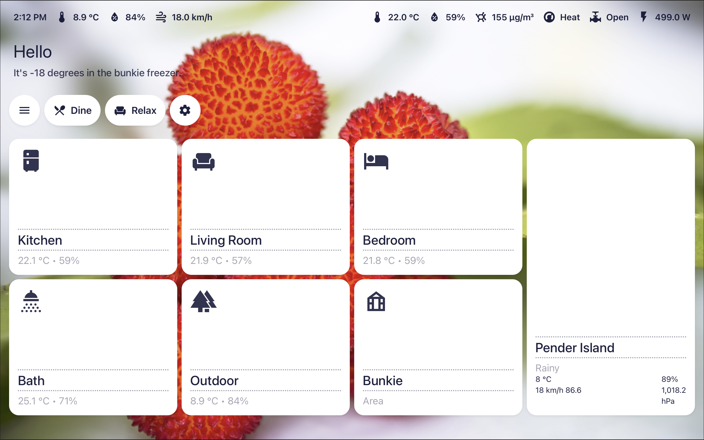
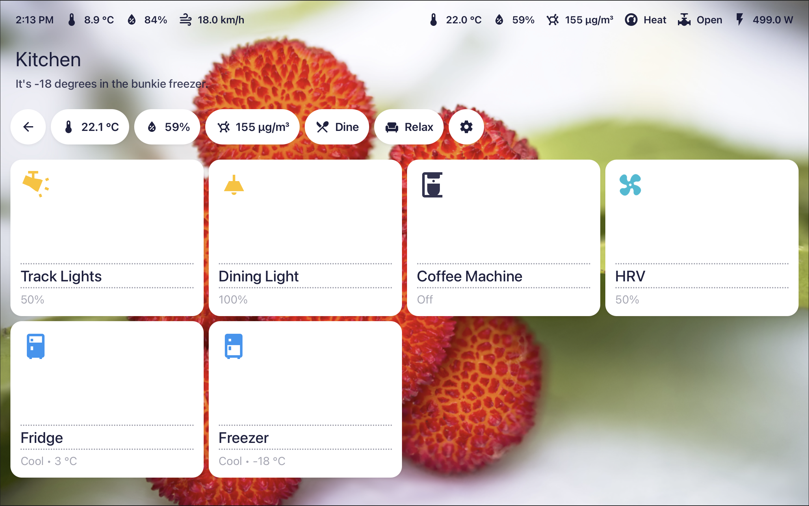
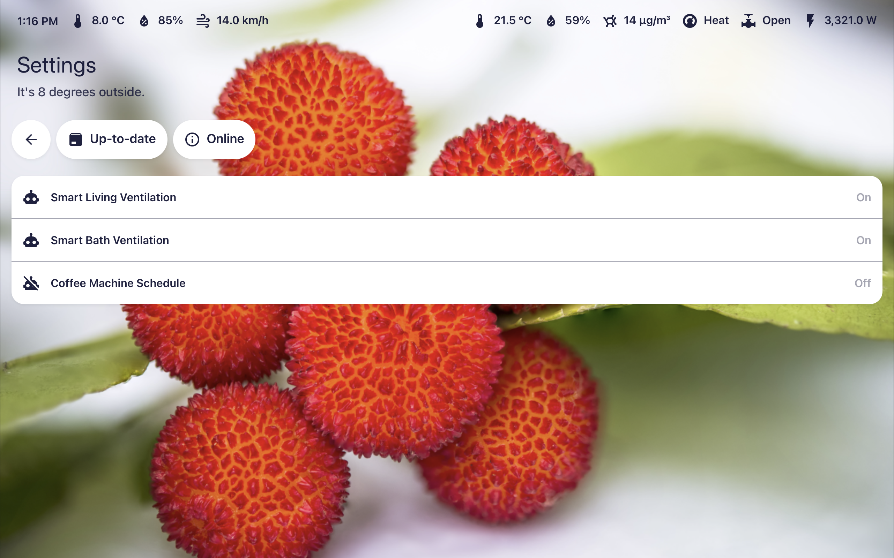

# Modern UI Cards by [@lupinglade](https://github.com/cyaneous) 





This is an early version of a clean, modern custom card set for Home Assistant that is optimized for use with touch panels/tablets and uses a larger font. Intended to be used with the Graphite theme, though other themes should work fine too.

The area card will use the new temperature and humidity sensors defined for the area under Settings > Areas in Home Assistant.

The weather card is incomplete and UI configuration is not yet supported for the chip-based cards.

## Installation

Install via HACS or add as a resource to your dashboard.

```yaml
resources:
  url: /local/modern-ui-cards.js
  type: module
```

## Examples

### Status bar

```yaml
type: custom:modern-chip-card
statusbar: true
chips:
  - type: message
    entity: sensor.date_time_formatted
  - type: entity
    entity: sensor.outdoor_temperature
  - type: entity
    entity: sensor.outdoor_humidity
  - type: entity
    entity: sensor.wind_speed
  - type: spacer
  - type: entity
    entity: sensor.indoor_temperature_average
  - type: entity
    entity: sensor.indoor_humidity_average
  - type: entity
    entity: sensor.main_watts
```

### Chip card

```yaml
type: custom:modern-chip-card
chips:
  - type: back
  - type: entity
    entity: sensor.eve_room_f86f_temperature
  - type: entity
    entity: sensor.eve_room_f86f_humidity
  - type: entity
    entity: sensor.eve_room_f86f_volatile_organic_compound_density
  - type: action
    action: navigate
    url: ./settings
    icon: mdi:cog
```

### Header card

```yaml
type: custom:modern-header-card
title: Living Room # or use title_entity to use an entity
subtitle_entity: sensor.system_status # or use subtitle to use a fixed string
```

### Area card

```yaml
type: custom:modern-area-card
area: kitchen
```

### Entity card

```yaml
type: custom:modern-entity-card
entity: sensor.outdoor_temperature
name: Custom Name # optional
```

Note: by default, area name prefix will be automatically removed from entity names for you!

### List card

```yaml
type: custom:modern-list-card
chips:
  - type: entity
    entity: sensor.outdoor_temperature
  - type: entity
    entity: automation.smart_bath_lighting
```

### Weather card

```yaml
type: custom:modern-weather-card
entity: weather.forecast_home
```
